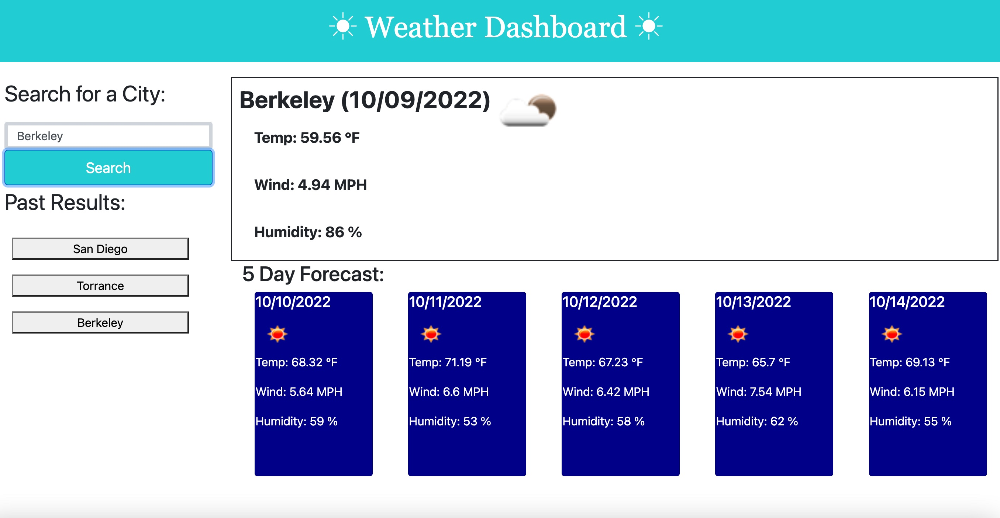

# Weather Dashboard

## Site Picture

Deployed Link
https://wseban.github.io/Weather-Dashboard/

## Usage
The user is presented with an input box and search button.  Upon inputting the desired city and pressing "Search", the user is presented with an entire page of weather information including date, temperature(°F), wind speed, humidity and an icon based on the days visibility/cloud conditions.  As well as today's weather conditions, the user is also presented with the next five days, of all the same information, in the boxes below the current day's weather report.



## Technologies Used
- Open Weather server API - sends updated data on weather conditions when asked by webpages.
- Bootstrap - a third party API with pre designed elements advancing the range of style on a webpage.
- Moment.js - a third party API that allows formatting and manipulation of current time stamps.
- JavaScript - Allows developer to make static webpages, dynamic and interactive.  For this exercise it was used to link the webpage to open weather server API, present the data received, dynamically create and append elements to present the data needed and engage with the specific user wants.  
- HTML - Gives a basic static structure to the webpage.
- CSS - Allows the developer to make the webpage a little more appealing.
- Git - Git is what I used to work on my personal computer and pushing my work to GitHub.
- GitHub - A cloud based repository that holds my saved code reserved for resetting my personal computer deployment.

## Description

The purpose of this project was to practice fetching specific information from a server API and dynamically presenting it in a visibly appealing format to the user.  This was fantastic javascript practice and utilization of the fetch function within Javascript. 

## Installation

NA

## Lessons Learned
The most effective lessons learned for me were...
1. This was the first time that I encountered a launched website not work(when my working tree website returned no errors), this was due to the current security standards of google and the linked website.  This took a small amount of time to trouble shoot given the errors seen in the console.
2. Differing how the code reacted given hitting a prior searched city vs searching a new city.  Below you will see how I resolved the issue.  
3. Troubleshooting using one API to feed another as you see below for latitude, longitude coordinates.

## Code Snippets
```javascript
function receiveWeatherData(event){
    console.log(event);
    if (event.target.id === "searchCityBtn"){
        desiredCity = inputEl.value.trim()
    }
    if (event.target.id === "history-Btn"){
        desiredCity = event.target.innerHTML
    }
geoCode = "https://api.openweathermap.org/geo/1.0/direct?q=" + desiredCity + "&limit=5&appid=c7da76dff8b1bd8f228c32b1196cf664";
    fetch (geoCode)
        .then(function(response){
            return response.json()
        })
        .then(function(data){
            //console.log(data)
            lat = data[0].lat
            //console.log(lat);
            lon = data[0].lon
        })
            .then(function(){
                weatherUrl = "https://api.openweathermap.org/data/2.5/forecast?lat=" + lat + "&lon=" + lon + "&units=imperial&limit=5&appid=c7da76dff8b1bd8f228c32b1196cf664";
                fetch(weatherUrl)
                    .then(function(response){
                        //console.log(response)
                            return response.json()
                             })
                            .then(function(data){

```
## Credits

NA

## License
Please refer to the LICENSE in the Repo.

